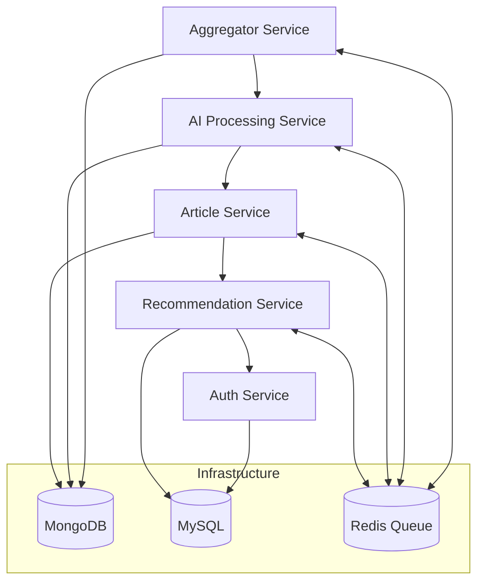

# 🧠 AI Content Platform — Microservices Architecture

This repository serves as the **entry point (face repo)** for the **AI Content Platform**, a distributed microservices-based system designed to automate **content aggregation, AI-driven analysis, and personalized recommendations**.

The platform is built using **Node.js**, **TypeScript**, and a combination of **Redis**, **MongoDB**, and **MySQL**, emphasizing **modularity**, **scalability**, and **clean architecture**.

---

## 🚀 Overview

The **AI Content Platform** consists of multiple microservices, each responsible for a specific domain.  
Together, they form a seamless pipeline that:

- 📰 Fetches and aggregates articles from multiple sources  
- 🤖 Summarizes and analyzes content using AI  
- 👤 Manages authentication, roles, and vendors  
- 🎯 Delivers personalized recommendations  
- ⚡ Processes data asynchronously via Redis queues  

---

## 🧩 Architecture at a Glance

