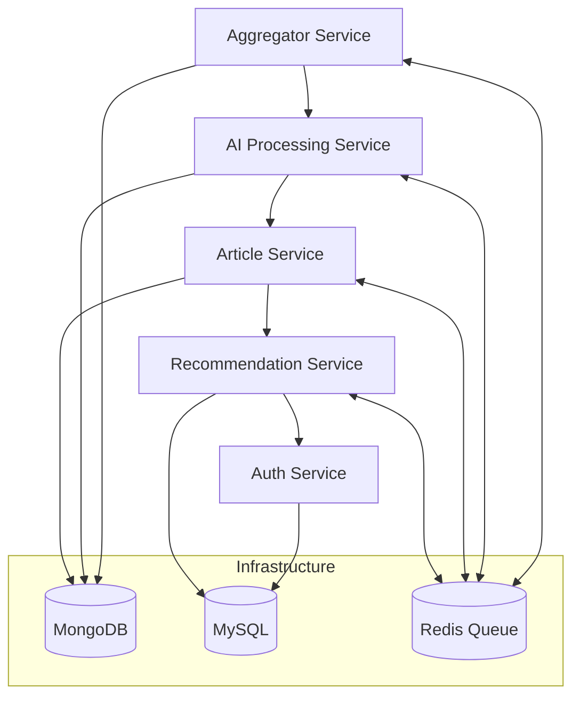

# 🧠 AI Content Platform — Microservices Architecture

This repository serves as the **entry point (face repo)** for the **AI Content Platform**, a distributed microservices-based system designed to automate **content aggregation, AI-driven analysis, and personalized recommendations**.

The platform is built using **Node.js**, **TypeScript**, and a combination of **Redis**, **MongoDB**, and **MySQL**, emphasizing **modularity**, **scalability**, and **clean architecture**.

---

## 🚀 Overview

The **AI Content Platform** consists of multiple microservices, each responsible for a specific domain.  
Together, they form a seamless pipeline that:

- 📰 Fetches and aggregates articles from multiple sources  
- 🤖 Summarizes and analyzes content using AI  
- 👤 Manages authentication, roles, and vendors  
- 🎯 Delivers personalized recommendations  
- ⚡ Processes data asynchronously via Redis queues  

---

---

## 📚 Related Repositories

| Service | Description | Repository |
|----------|--------------|-------------|
| 📰 **Scrapper Service** | Crawls and aggregates articles from HTML/RSS websites, cleans data, and pushes it to Redis queues. | [Aggregator Service Repo](https://github.com/Sido7/scrapperService) |
| 🤖 **AI Processing Service** | Consumes queued data and processes it using AI APIs (Gemini, OpenAI) to summarize, extract keywords, and classify sentiment. Stores processed articles in MongoDB and provides APIs for content retrieval and filtering. | [AI Service Repo](https://github.com/Sido7/aiService) |
| 👤 **Auth Service** | Manages user registration, login, vendor onboarding, and role-based authentication using MySQL. | [Auth Service Repo](https://github.com/Sido7/AuthServiceAI) |
| 🎯 **Recommendation Service** | Generates personalized article recommendations based on user interactions, preferences, or trends. | [Recommendation Service Repo](https://github.com/Sido7/Recommendation-Service) |
| 🧱 **Redis Service** | Contains the basic setup for redis using the docker for messaging queue and caching | [Common Lib Repo](https://github.com/Sido7/redisService) |

---

## 🧩 Architecture at a Glance

